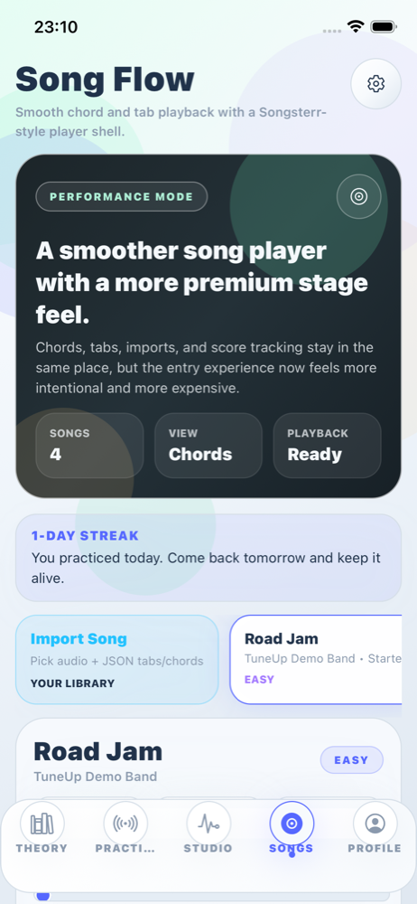
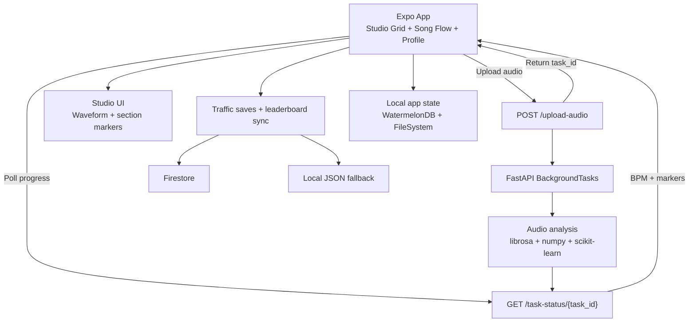
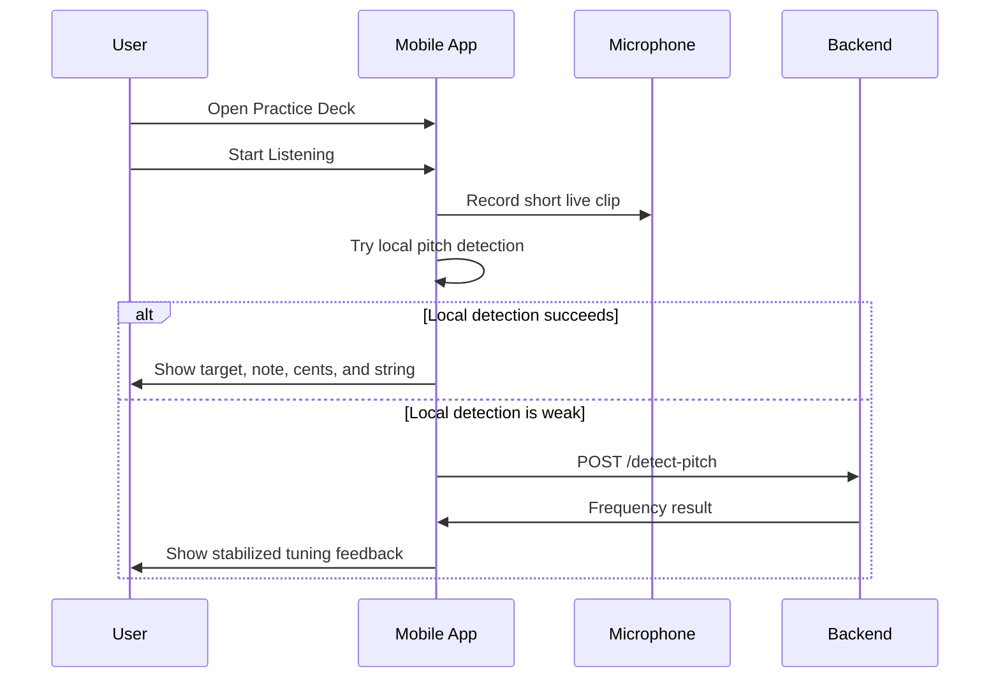
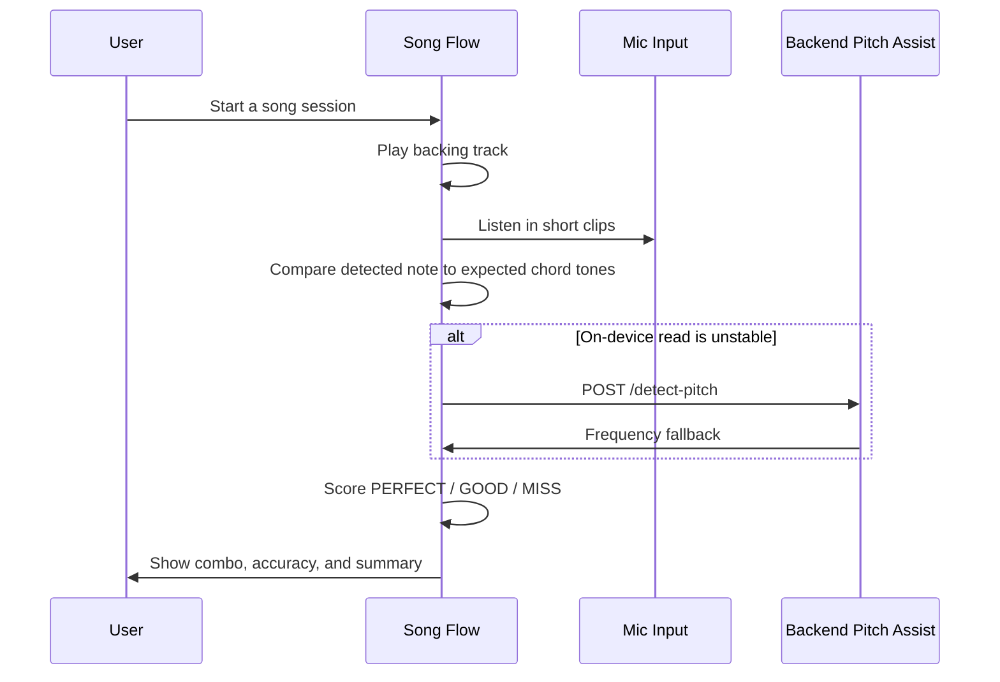
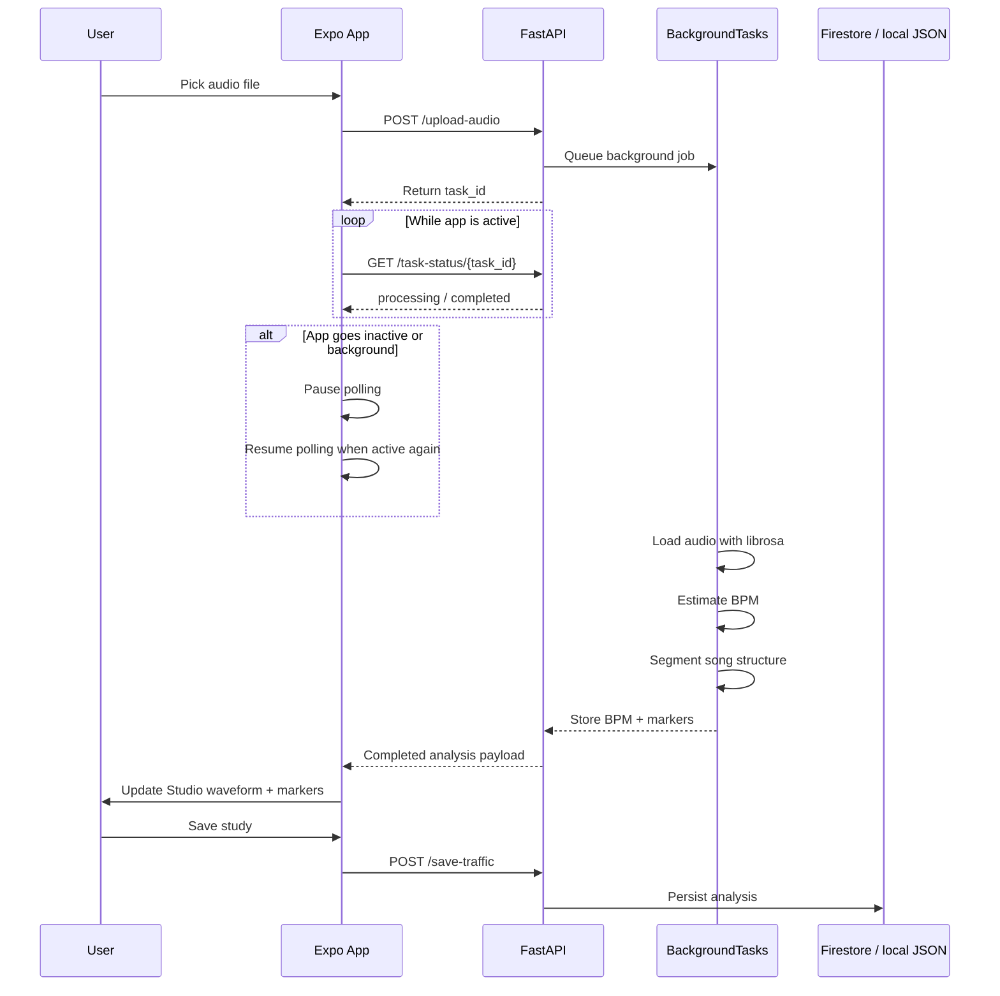

# TuneUp 🎵

<p align="center">
  
</p>

<p align="center">
  <strong>A premium mobile music-learning platform built with Expo, React Native, FastAPI, and Firebase.</strong>
</p>

<p align="center">
  TuneUp combines tuning, theory training, song practice, studio-style arrangement analysis, profiles, streaks, and gamification in a single mobile-first experience.
</p>

<p align="center">
  
  
  
  
  
</p>

---

## ✨ Overview

TuneUp is a full-stack music practice app designed to feel like a modern premium product, while still being practical for real daily training.

It includes:
- 🎸 **Practice Deck** for instrument tuning and live microphone-based pitch feedback
- 📚 **Theory Lab** for lessons, theory quiz, drag puzzles, audio quiz, and quick note drills
- 🎛️ **Studio Grid** for arrangement analysis, BPM detection, section markers, and song structure study
- 🎵 **Song Flow** for chord-following, tab playback, guided practice, imported songs, and performance scoring
- 👤 **Profile & Settings** for progress tracking, badges, streaks, leaderboard data, saved songs, lesson history, and app preferences
- 🏆 **Gamification** with XP, levels, streaks, leaderboard sync, and unlockable badges

The project is split into:
- a **React Native + Expo** mobile app in [`MusicAIApp`](./MusicAIApp)
- a **Python + FastAPI** backend in [`backend`](./backend)

The most important developer-facing flow is the Studio Grid analysis loop, which now behaves like one coordinated full-stack system:

1. The user selects an audio file in the Expo app.
2. The frontend uploads it to `POST /upload-audio`.
3. The backend immediately returns a `task_id`.
4. FastAPI `BackgroundTasks` runs BPM + segmentation analysis with `librosa`.
5. The frontend polls `GET /task-status/{task_id}` for progress and completion.
6. If the app backgrounds, polling pauses; when the app becomes active again, polling resumes.
7. Once complete, the frontend receives BPM and section markers and updates the Studio UI.
8. Traffic-analysis saves and leaderboard data persist through Firestore, with local JSON fallback when cloud storage is unavailable.

---

## 🧩 System At a Glance

| Layer | What it owns | Key files |
|---|---|---|
| **Expo app** | screen rendering, audio picking, task polling, app-state-aware scan UX, local settings/import persistence | `MusicAIApp/src/screens/TrafficScreen.tsx`, `MusicAIApp/src/hooks/useAudioAnalysisJob.ts`, `MusicAIApp/src/services/api.ts` |
| **FastAPI backend** | async upload handling, BPM + segmentation analysis, health checks, fallback pitch detection, persistence APIs | `backend/main.py`, `backend/models.py` |
| **Persistence layer** | Firestore-backed traffic saves and leaderboard data, with local JSON fallback for degraded-mode recovery | `backend/traffic_db.json`, `backend/leaderboard_db.json`, `backend/.env.example` |

This split is intentional: the app owns responsiveness and session UX, the backend owns heavier analysis work, and persistence can degrade gracefully without breaking scan and save flows.

---

## 🖼️ App Preview

### Song Flow preview

<p align="center">
  
</p>

**What this preview shows:**
- the premium Song Flow shell
- the upgraded top hero treatment
- smooth sectioned layout with streak, library, and playback entry point
- the soft-light visual system used across the app

---

## 🧭 Table of Contents

- [✨ Overview](#-overview)
- [🧩 System At a Glance](#-system-at-a-glance)
- [🖼️ App Preview](#️-app-preview)
- [🚀 Core Product Experience](#-core-product-experience)
- [🗂️ Shipped Content](#️-shipped-content)
- [🏗️ Architecture](#️-architecture)
- [📱 Frontend Stack](#-frontend-stack)
- [⚙️ Backend Stack](#️-backend-stack)
- [🔁 Runtime Flows](#-runtime-flows)
- [🧠 Feature Deep Dive](#-feature-deep-dive)
- [📦 Project Structure](#-project-structure)
- [🔌 API Endpoints](#-api-endpoints)
- [🎼 Song Import Format](#-song-import-format)
- [🛠️ Local Development Setup](#️-local-development-setup)
- [🔐 Security Notes](#-security-notes)
- [🧪 Quality Checks](#-quality-checks)
- [🚚 Deployment Notes](#-deployment-notes)
- [🧭 Suggested Git Workflow](#-suggested-git-workflow)
- [📝 Current Status](#-current-status)

---

## 🚀 Core Product Experience

### 1. Practice Deck 🎯

A live instrument practice space focused on immediate clarity.

**Highlights**
- Supports **Guitar**, **Bass**, **Ukulele**, and **Drums**
- Live microphone capture via `expo-av`
- Local pitch analysis plus optional backend pitch assist fallback
- Visual tuning meter with cents/string guidance
- Settings-controlled helper views and frequency readout

**Use cases**
- Quick tuning before practice
- Checking pitch stability
- Basic live input confidence building
- Drum hit presence feedback

---

### 2. Theory Lab 📚

A premium study area built around fast repetition, guided lessons, and music-reading exercises.

**Included modes**
- **Lesson Packs**
- **Theory Quiz**
- **Quick Note**
- **Drag Puzzle**
- **Audio Quiz**

**Highlights**
- Premium structured lessons with visual aids
- Animated learning visuals such as:
  - chord diagrams
  - finger placement previews
  - tab snippets
  - keyboard maps
  - drum rudiment lanes
- XP and streak rewards for practice completion
- Premium loading states and celebration overlays

---

### 3. Studio Grid 🎛️

A structure-analysis workspace for song study and arrangement thinking.

**Highlights**
- Load a song file from the device
- Start an async backend BPM + section analysis job
- Poll lightweight task status updates while the backend scans
- Review waveform chunks with markers
- Save studies and surface them later in Profile
- Browse **built-in traffic studies** for reference material

**Intended value**
- Practice arrangement awareness
- Understand section boundaries
- Build rehearsal notes faster
- Give learners a simplified “studio brain” view

---

### 4. Song Flow 🎵

The guided song-learning mode, designed for a “play with the track” experience.

**Highlights**
- Internal panels for:
  - **Chords**
  - **Tabs**
  - **Guide**
- Water-smooth lane rendering with Skia
- Chord scoring through live mic listening
- Tabs mode for guided timing playback
- Seek bar + jump controls
- Song import flow for audio + JSON chart pairing
- Backing tracks and imported library persistence

---

### 5. Profile & Settings 👤

A single destination for identity, progress, libraries, rewards, and configuration.

**Highlights**
- XP, level, streak, longest streak, lesson count, quiz count, song count
- Clickable shelves for:
  - completed lessons
  - saved / completed songs
  - studio saves
  - badge catalog
- Detailed badge states:
  - locked = monochrome
  - unlocked = colored
- App-wide settings with tab-level controls

---

## 🗂️ Shipped Content

The app already contains meaningful learning content, not just shell UI.

### Lesson packs
- 🎸 **20 guitar lessons**
- 🎹 **20 piano lessons**
- 🥁 **10 drum lessons**

### Theory content
- 🧠 **50 theory quiz questions**
- 🎧 audio chord quiz content
- 🎼 note-reading and drag-puzzle drills

### Song / structure content
- 🎵 **4 built-in demo songs** with chords and tabs
- 🎛️ **10 built-in traffic studies** for structure learning
- 📥 imported songs supported through local JSON + audio pairing

### Gamification content
- 🏅 badge catalog with unlock rules
- 🔥 streak tracking
- 🥇 leaderboard sync support
- ⭐ XP and level progression

---

## 🏗️ Architecture



### Architectural goals
- Keep the mobile experience **offline-friendly where possible**
- Use the backend for **heavier or more reliable audio analysis**
- Persist user-facing state locally for a smooth app feel
- Sync competitive / shared data to Firestore only where it makes sense

### Operational notes
- `GET /healthz` reports backend readiness, active storage mode, and Firebase connectivity state.
- The async scan path is `POST /upload-audio` followed by `GET /task-status/{task_id}` polling, with `POST /analyze-full` kept as a synchronous fallback path.
- Frontend API requests currently point at `BASE_URL` inside [`MusicAIApp/src/services/api.ts`](./MusicAIApp/src/services/api.ts), while [`MusicAIApp/.env.example`](./MusicAIApp/.env.example) documents the intended `EXPO_PUBLIC_API_BASE_URL` value for hosted environments.
- Backend Firebase credentials can come from `FIREBASE_SERVICE_ACCOUNT_JSON`, `GOOGLE_APPLICATION_CREDENTIALS`, or a local `backend/serviceAccountKey.json`.
- Traffic saves and leaderboard records use Firestore when available, then fall back to local JSON stores for recovery-friendly behavior during local development or temporary cloud misconfiguration.

### Persistence model
- **On-device:** app settings, imported songs, and local experience state stay inside the mobile app for a fast, resilient UX.
- **Backend shared data:** traffic-analysis saves and leaderboard records flow through FastAPI so the app only deals with one API surface.
- **Recovery mode:** if Firestore is missing or unhealthy, the backend writes to `backend/traffic_db.json` and `backend/leaderboard_db.json` so user actions still complete.

---

## 📱 Frontend Stack

The mobile app lives in [`./MusicAIApp`](./MusicAIApp).

### Primary technologies
- **Expo 54**
- **React Native 0.81**
- **TypeScript**
- **React Navigation**
- **React Native Reanimated**
- **Gesture Handler**
- **Shopify Skia**
- **Expo AV**
- **Expo Document Picker**
- **Expo File System**
- **Expo Haptics**
- **Lottie React Native**
- **WatermelonDB**

### Frontend responsibilities
- render all learning and practice screens
- manage local UI state
- store app settings locally
- store imported songs locally
- store gamification state locally
- record microphone input
- perform lightweight pitch analysis on-device
- call backend endpoints when deeper analysis is needed

---

## ⚙️ Backend Stack

The backend lives in [`./backend`](./backend).

### Primary technologies
- **FastAPI**
- **Pydantic**
- **librosa**
- **NumPy**
- **scikit-learn**
- **Firebase Admin SDK**
- **Firestore**

### Backend responsibilities
- BPM analysis
- full-track structure analysis
- pitch detection fallback from uploaded audio clips
- traffic-analysis persistence
- leaderboard profile sync
- leaderboard retrieval

---

## 🔁 Runtime Flows

### Practice tuning flow



### Song Flow scoring flow



### Traffic analysis flow



---

## 🧠 Feature Deep Dive

### Practice Deck

**Files involved**
- [`MusicAIApp/src/screens/PracticalScreen.tsx`](./MusicAIApp/src/screens/PracticalScreen.tsx)
- [`MusicAIApp/src/utils/pitchDetection.ts`](./MusicAIApp/src/utils/pitchDetection.ts)
- [`MusicAIApp/src/utils/tuningData.ts`](./MusicAIApp/src/utils/tuningData.ts)
- [`MusicAIApp/src/services/api.ts`](./MusicAIApp/src/services/api.ts)

**What it does**
- captures short clips with `expo-av`
- tries on-device pitch detection first
- falls back to backend pitch detection when needed
- converts raw frequency into note and closest string guidance
- supports drums with a simpler signal-energy feedback mode

**User-facing outputs**
- current target note
- detected note
- frequency in Hz
- cents off target
- active string
- engine source: local or backend assist

---

### Theory Lab

**Files involved**
- [`MusicAIApp/src/screens/TheoryScreen.tsx`](./MusicAIApp/src/screens/TheoryScreen.tsx)
- [`MusicAIApp/src/data/lessonLibrary.ts`](./MusicAIApp/src/data/lessonLibrary.ts)
- [`MusicAIApp/src/data/theoryQuizQuestions.ts`](./MusicAIApp/src/data/theoryQuizQuestions.ts)
- [`MusicAIApp/src/data/theoryPuzzles.ts`](./MusicAIApp/src/data/theoryPuzzles.ts)
- [`MusicAIApp/src/data/audioChordQuiz.ts`](./MusicAIApp/src/data/audioChordQuiz.ts)
- [`MusicAIApp/src/components/LessonVisualGallery.tsx`](./MusicAIApp/src/components/LessonVisualGallery.tsx)

**What it does**
- presents structured lesson packs by instrument
- runs quiz and puzzle mini-games
- rewards progress through XP and streak logic
- renders visual lesson support such as finger placement and rudiment previews

**Lesson model includes**
- title and subtitle
- tier and duration
- goal
- focus tags
- warmup
- lesson steps
- practice loop
- coach notes
- checkpoint
- attached learning visuals

---

### Studio Grid

**Files involved**
- [`MusicAIApp/src/screens/TrafficScreen.tsx`](./MusicAIApp/src/screens/TrafficScreen.tsx)
- [`MusicAIApp/src/hooks/useAudioAnalysisJob.ts`](./MusicAIApp/src/hooks/useAudioAnalysisJob.ts)
- [`MusicAIApp/src/data/trafficAnalysisLibrary.ts`](./MusicAIApp/src/data/trafficAnalysisLibrary.ts)
- [`backend/main.py`](./backend/main.py)

**What it does**
- loads audio into a study session
- uploads the file to an async backend scan endpoint
- receives a `task_id` immediately and polls for progress/result updates
- pauses polling while the app is backgrounded and resumes when the app returns active
- applies BPM + section markers to the waveform strip when the job completes
- saves analysis data for later review through Firestore with local JSON fallback

**Built-in use cases**
- arrangement study
- rehearsal prep
- timing-aware section planning
- comparison between built-in studies and user-loaded songs

---

### Song Flow

**Files involved**
- [`MusicAIApp/src/screens/SongScreen.tsx`](./MusicAIApp/src/screens/SongScreen.tsx)
- [`MusicAIApp/src/data/songLessons.ts`](./MusicAIApp/src/data/songLessons.ts)
- [`MusicAIApp/src/services/songLibrary.ts`](./MusicAIApp/src/services/songLibrary.ts)

**What it does**
- supports built-in songs and imported songs
- plays backing tracks with transport controls
- renders chord and tab guidance in a premium shell
- scores chord mode with live microphone listening
- uses tabs mode as timing-guided playback
- stores imported songs locally for reuse

**Built-in schema**
- `SongChordEvent` → `{ timeSec, chord, laneRow }`
- `SongTabNote` → `{ timeSec, stringIndex, fret, durationSec? }`
- `SongLesson` → `{ id, title, artist, difficulty, backingTrack, durationSec, chordEvents, tabNotes }`

---

### Profile, Badges, and Settings

**Files involved**
- [`MusicAIApp/src/screens/ProfileScreen.tsx`](./MusicAIApp/src/screens/ProfileScreen.tsx)
- [`MusicAIApp/src/services/gamification.ts`](./MusicAIApp/src/services/gamification.ts)
- [`MusicAIApp/src/services/appSettings.ts`](./MusicAIApp/src/services/appSettings.ts)

**What it does**
- stores player identity locally
- tracks streaks and completions
- unlocks badges based on actual activity
- syncs leaderboard data when enabled
- exposes app settings per major tab

**Current badge examples**
- `First Song`
- `Drum Master`
- `Lesson Starter`
- `Theory Starter`
- `3-Day Streak`

---

## 📦 Project Structure

```text
TuneUp/
├── MusicAIApp/
│   ├── assets/
│   │   ├── audio/
│   │   └── readme/
│   ├── src/
│   │   ├── animations/
│   │   ├── components/
│   │   ├── data/
│   │   │   ├── lessonPacks/
│   │   │   └── *.ts
│   │   ├── database/
│   │   ├── hooks/
│   │   ├── screens/
│   │   ├── services/
│   │   └── utils/
│   ├── App.tsx
│   ├── app.json
│   └── package.json
├── backend/
│   ├── main.py
│   └── models.py
├── .gitignore
└── README.md
```

### Important frontend directories
- `src/screens/` → top-level app tabs and feature screens
- `src/components/` → reusable UI building blocks
- `src/data/` → built-in lesson, quiz, song, and study content
- `src/services/` → API, gamification, settings, and song import logic
- `src/database/` → WatermelonDB persistence helpers
- `src/utils/` → pitch and tuning helpers

### Important backend files
- `backend/main.py` → FastAPI app, async analysis routes, health checks, leaderboard routes, traffic persistence
- `backend/models.py` → Pydantic models for structured backend data

---

## 🔌 API Endpoints

| Method | Endpoint | Purpose |
|---|---|---|
| `GET` | `/` | readiness message with storage summary |
| `GET` | `/healthz` | backend status, storage mode, and Firebase health |
| `POST` | `/recommend` | mood-based song recommendation demo |
| `POST` | `/analyze-bpm` | simple BPM detection |
| `POST` | `/detect-pitch` | backend pitch detection fallback |
| `POST` | `/upload-audio` | upload a track and create a background song-analysis job |
| `GET` | `/task-status/{task_id}` | fetch progress or completed results for an analysis task |
| `POST` | `/save-traffic` | persist a traffic analysis to Firestore or local JSON fallback |
| `GET` | `/get-traffic` | fetch saved traffic analyses from the active persistence layer |
| `POST` | `/sync-leaderboard` | sync leaderboard profile data to the active persistence layer |
| `GET` | `/leaderboard` | fetch top leaderboard entries from the active persistence layer |
| `POST` | `/analyze-full` | legacy synchronous BPM + structure analysis fallback |

---

## 🎼 Song Import Format

Song import is handled by [`MusicAIApp/src/services/songLibrary.ts`](./MusicAIApp/src/services/songLibrary.ts).

### Required import flow
- choose an **audio file**
- choose a **JSON manifest**
- import into the local Song Flow library

### Supported JSON structure

```json
{
  "title": "Example Song",
  "artist": "Example Artist",
  "difficulty": "Medium",
  "durationSec": 120,
  "chordEvents": [
    { "timeSec": 0.0, "chord": "Em", "laneRow": 1 },
    { "timeSec": 2.0, "chord": "G", "laneRow": 0 }
  ],
  "tabNotes": [
    { "timeSec": 0.0, "stringIndex": 1, "fret": 3, "durationSec": 0.5 },
    { "timeSec": 0.5, "stringIndex": 2, "fret": 2, "durationSec": 0.4 }
  ]
}
```

### Notes
- `laneRow` should stay in the `0..3` range
- `stringIndex` should stay in the `0..5` range
- at least one of `chordEvents` or `tabNotes` must be present
- imported audio is copied into the app sandbox for persistence across reloads

---

## 🛠️ Local Development Setup

### Prerequisites

### Frontend
- Node.js 18+
- npm
- Xcode Simulator for iOS testing or Android Studio for Android testing

### Backend
- Python 3.11+ recommended
- virtual environment support
- Firebase credentials for Firestore-backed features if you want durable cloud storage

---

### 1. Clone the project

```bash
git clone <YOUR_GITHUB_REPO_URL>
cd <YOUR_PROJECT_DIRECTORY>
```

---

### 2. Start the backend

Create and activate a Python virtual environment if needed, then install the backend dependencies.

```bash
cd backend
python3 -m venv venv
source venv/bin/activate
pip install fastapi uvicorn python-multipart librosa numpy scikit-learn firebase-admin
```

### Backend environment setup

The backend now supports both local-file credentials and environment-based deployment credentials.

Firebase credential resolution currently works in this order:
1. `FIREBASE_SERVICE_ACCOUNT_JSON`
2. `GOOGLE_APPLICATION_CREDENTIALS`
3. `backend/serviceAccountKey.json`

Example values live in:

```text
backend/.env.example
```

If Firebase is unavailable, the backend still boots, `GET /healthz` reports the degraded state, and the API falls back to local JSON storage for traffic saves and leaderboard data.

### Run the backend

```bash
cd "/path/to/project/backend"
source venv/bin/activate
uvicorn main:app --reload --host 0.0.0.0 --port 8000
```

---

### 3. Start the frontend

```bash
cd "/path/to/project/MusicAIApp"
npm install
npx expo start -c
```

You can then open:
- **iOS simulator** with `i`
- **Android emulator** with `a`
- **Expo Go** by scanning the QR code on a real device

---

### 4. Configure frontend API access

The current frontend request target is the `BASE_URL` constant in [`MusicAIApp/src/services/api.ts`](./MusicAIApp/src/services/api.ts).

[`MusicAIApp/.env.example`](./MusicAIApp/.env.example) documents the intended `EXPO_PUBLIC_API_BASE_URL` value for hosted deployments, but this repo snapshot still uses the in-file constant unless you wire the env var into the app code.

Use the example file as the naming reference for hosted configuration, or wire it into the app if you want env-driven frontend URL resolution:

```text
MusicAIApp/.env.example
```

### Typical values
- Render: `https://YOUR_RENDER_SERVICE.onrender.com`
- iOS simulator: `http://127.0.0.1:8000`
- Android emulator: `http://10.0.2.2:8000`
- physical phone: `http://YOUR_LOCAL_IP:8000`

To find your local IP on macOS:

```bash
ipconfig getifaddr en0
```

### 5. End-to-end smoke path

Once both services are running, this is the fastest way to confirm the full stack is healthy:

1. Open `http://127.0.0.1:8000/healthz` and confirm the backend responds.
2. Launch the Expo app and point `BASE_URL` at the backend you want to test.
3. Open **Studio Grid**, pick an audio file, and tap **Scan**.
4. Confirm the UI shows upload/progress messaging first, then BPM + section markers after completion.
5. Save the study and verify the backend reports either Firestore storage or local JSON fallback.

---

## 🔐 Security Notes

Security is critical for this project because it contains mobile app code, backend services, and cloud credentials.

### Never commit
- `.env`
- `.env.*`
- `serviceAccountKey.json`
- `backend/traffic_db.json`
- `backend/leaderboard_db.json`
- `node_modules/`
- `venv/`
- `.venv/`
- `__pycache__/`
- `.expo/`
- any `uploads/` directory
- local database / runtime artifacts

### Included protections
- a root-level `.gitignore` should block sensitive and bulky files
- `backend/serviceAccountKey.json` is intended to stay local only
- backend JSON fallback stores are runtime data and should stay local only
- uploads and generated caches should stay out of version control

### Recommended security practices
- use a dedicated Firebase service account with the minimum required permissions
- rotate credentials if a secret was ever committed in the past
- keep repository visibility private until secret hygiene is verified
- use environment-specific backend configs instead of hardcoding production secrets

---

## 🧪 Quality Checks

Recommended checks before every push:

```bash
cd MusicAIApp
npx tsc --noEmit
npx expo-doctor
```

Backend sanity check:

```bash
cd backend
python3 -m py_compile main.py
```

API smoke checks:

```bash
curl http://127.0.0.1:8000/
curl http://127.0.0.1:8000/healthz
```

---

## 🚚 Deployment Notes

### Mobile app
This project is optimized for Expo development, and the mobile app can point at either a local backend or a hosted service such as Render. In the current repo snapshot, that target is still controlled by `BASE_URL` in [`MusicAIApp/src/services/api.ts`](./MusicAIApp/src/services/api.ts).

A production release path would typically include:
- EAS Build for mobile binaries
- environment-backed API configuration or a deployment-specific `BASE_URL`
- proper asset optimization
- analytics / crash reporting
- app-store compliant permission copy

### Backend
For production deployment, the backend should be hosted on a secure Python runtime such as:
- Railway
- Render
- Fly.io
- Google Cloud Run
- AWS ECS / Lambda (with adaptation)

Production hardening would include:
- secret management via environment variables or secret store
- HTTPS
- request limits / abuse protection
- monitoring and logs
- storage cleanup policies for uploaded files
- durable cloud storage for leaderboard and traffic-analysis persistence

### Render-specific notes
- use `/` or `/healthz` to verify the service is awake and whether Firestore is connected
- set `FIREBASE_SERVICE_ACCOUNT_JSON` if you want Firestore-backed traffic saves and leaderboard sync
- set `CORS_ALLOW_ORIGINS` if you are calling the API from web origins
- point the mobile app to the live backend by updating `BASE_URL` in [`MusicAIApp/src/services/api.ts`](./MusicAIApp/src/services/api.ts), or by wiring `EXPO_PUBLIC_API_BASE_URL` into the app first
- expect Studio Grid scans to use `POST /upload-audio` plus `GET /task-status/{task_id}` polling instead of one long blocking request
- expect hosted instances to cold-start occasionally; the frontend already warms the backend before uploads
- if Firebase is misconfigured, the backend falls back to local JSON storage so analysis and save flows keep responding, but Firestore is still the durable production path

---

## 🧭 Suggested Git Workflow

### First secure push

```bash
git branch -M main
git remote set-url origin <YOUR_GITHUB_REPO_URL>
git rm -r --cached --ignore-unmatch backend/__pycache__ backend/uploads backend/venv .venv MusicAIApp/node_modules MusicAIApp/.expo
git rm --cached --ignore-unmatch backend/serviceAccountKey.json .env .env.*
git add -A
git commit -m "Initial secure project import"
git push -u origin main
```

### Everyday update workflow

```bash
git checkout main
git pull --rebase origin main
git status --short
git add -A
git commit -m "Describe your change"
git push origin main
```

### Recommended safety habit

```bash
git status --short
git diff --cached --name-only
```

This helps catch accidental commits before they go to GitHub.

---

## 📝 Current Status

### Product areas already implemented
- ✅ multi-tab mobile app shell
- ✅ live tuner / practice experience
- ✅ structured lesson packs
- ✅ theory quiz and puzzle modes
- ✅ audio chord quiz
- ✅ song flow with chords + tabs
- ✅ local song import
- ✅ studio traffic analysis workflow
- ✅ profile dashboard
- ✅ streaks, XP, badges, leaderboard sync
- ✅ premium transitions, loading states, and celebration overlays

### Current packaged content
- ✅ 20 guitar lessons
- ✅ 20 piano lessons
- ✅ 10 drum lessons
- ✅ 50 theory quiz questions
- ✅ 10 built-in traffic studies
- ✅ 4 built-in demo songs

### Areas that can be expanded next
- richer production song libraries
- more advanced chord recognition
- deeper analytics and session history
- additional badge sets and seasonal challenges
- cloud-authenticated user accounts

---

## 🤝 Final Notes

This repository is structured to support both:
- **product-facing iteration** on the mobile experience
- **engineering-focused iteration** on audio analysis, learning systems, and backend services

If you want this README to go one level further, the next strong step would be adding:
- more simulator screenshots for each tab
- an animated demo GIF
- EAS build / release instructions
- backend deployment instructions for one specific host
